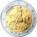

#  Currency  

Android currency conversion. The app is available on [F-Droid](https://f-droid.org/packages/org.billthefarmer.currency) and [here](https://github.com/billthefarmer/currency/releases).

## Extra currencies
For extra currencies please see my
[Specie](https://github.com/billthefarmer/specie) app with 150
currencies.

More ~currencies~, ~crypto-currencies~ and lots of other conversions
are in [Equate](https://github.com/EvanRespaut/Equate).

 

 

 * Currency rates from the [European Central Bank](https://www.ecb.europa.eu/stats/policy_and_exchange_rates/euro_reference_exchange_rates/html/index.en.html)
 * 32 international currencies
 * Currency rates updated daily
 * Last rate update retained for use offline
 * Extra currency for unsupported currencies
 * Ukrainian, German, Italian, French, Spanish, Indonesian, Russian
   and Norwegian translation
 * App widget to display selected currency

## Usage
### Edit
Touch the current currency value field to edit the value. The display
will be updated dynamically as you type. Touch the **Done** button on
the numeric keypad to update the value field.  The whole value field
is selected by default when touched so it will be overwritten by
typing in a new value. To deselect the text, touch an adjacent area,
like the currency flag.

### Toolbar
The icons in the toolbar from left to right are:
* **Add** a currency to the list. A scrollable list of currencies will
   pop up. Touch an entry to add it or touch the **Cancel** button
   below the list. Long touch an entry to select it. Once one currency
   is selected others may be added or removed from the selection by
   touching them. Another long touch on another currency will clear
   the list and select the new currency. Touch the **Clear** button to
   clear the selection. Touch the **Select** button to add the
   selection. The entries will be added to the list in the order
   selected.
* **Refresh** Get the day's currency rates from the
  [ECB](https://www.ecb.europa.eu/stats/policy_and_exchange_rates/euro_reference_exchange_rates/html/index.en.html). The
  date shown on the left above the currency list will be updated if
  new rates are available. It may show the previous day because the
  rates are updated at around 14:15 CET. The status display on the
  right above the currency list will show 'OK', 'No Connection', 'No
  WiFi' or 'Roaming' according to the update settings. It may show
  'Failed' if the connection times out or fails to connect.
* **Update** Update the currency rate for the extra currency against
  the Euro. A dialog will pop up with the current extra currency
  rate. Update the value and touch the OK button. The display will
  refresh if the extra currency is displayed.
* **Help** Display help text.
* **Settings** Display the settings screen.

### Edit currency list
Touch a currency entry in the list to make it current. The old current
currency will move to the top of the list. Long touch a currency entry
to select it. Once one currency is selected others may be added or
removed from the selection by touching them. Another long touch on
another currency will clear the list and select the new currency. The
icons in the toolbar will change to:
* **Clear** the selection.
* **Remove** the selected currencies.
* **Chart** Display a chart of selected currencies. If one is
  selected, the chart will be of the current currency and the selected
  currency. If more than one currency is selected the chart will be of
  the last two selected currencies.  Selecting the extra currency will
  produce a blank chart.
* **Copy** selection value to clipboard. Only one value will be copied.

## Widget
On creating a widget a selection dialog will pop up showing the
current currencies. Select the currency to display. This overrides the
**Widget entry** setting. Touch the configure icon in the top right of
the widget to change the currency. This will only change the currency
for the last widget created regardless of which widget was
touched. Android 12 provides an alternate method of configuring
widgets which will work correctly.

## Chart
The display shows an interactive chart of the last 90 days of
historical rates from the
[ECB](https://www.ecb.europa.eu/stats/policy_and_exchange_rates/euro_reference_exchange_rates/html/index.en.html). The
chart responds to two finger pinch and expand gestures and will scroll
once expanded. The toolbar icons from left to right are:
* **Invert** the chart.
* **New chart** The scrollable list of currencies will pop up. Select
  one or two currencies from the list as above to replace the current
  currencies in the chart.
* **Refresh** the chart.
* **Historical** The chart will be updated with nearly eighteen years
  of historical data currently dating from 1 January 1999. Not all the
  currencies go back this far. **Caution** - this will take a while,
  depending on the connection, and will download more than 6Mb of
  data.
* **Range** Change the chart range. The chart will show the latest
  data, but will scroll back. **Note** - ranges greater than a quarter
  will have no effect unless the chart is updated with the historical
  data.
  * **Week** One week
  * **Month** One month
  * **Quarter** Three months
  * **Year** One year
  * **5 Years** 5 Years
  * **Max** Maximum current range

## Settings
### Update
* **WiFi** Update while connected on WiFi only
* **Roaming** Update while roaming

### Widget
* **Widget entry** Select the currency entry to display in the
  widget. Defaults to the first. This is overridden by the widget
  configuration dialog.

### Numbers
* **Fraction digits** Select the number of digits to display after the
  decimal point. A popup list of options will be displayed.

### Chart
* **Fill** Fill the chart trace.

### Theme
* **Dark** Use dark theme

### About
* **About** Display the version, copyright and licence.
